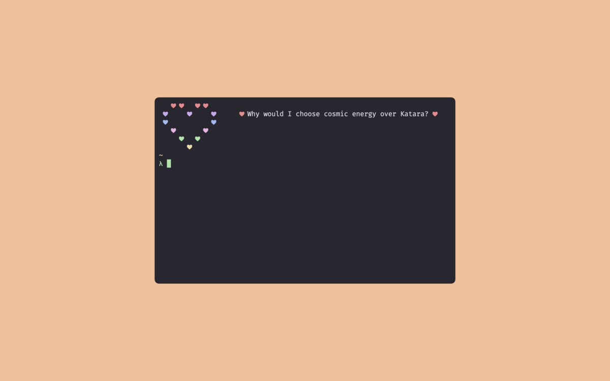

<h2 align="center"> ━━━━━━  ❖  ━━━━━━ </h2>

<!-- BADGES -->
<div align="center">
   <p></p>
   
      

      

   
   
   
   <br>
</div>

<p/>

---

### ❖ Information 

  lovesay is a simple and lightweight python script that displays a quote from a loved one based on the day of the month 

  

---

### ❖ Requirements 

- A quotes file stored in `.config/lovesay/`
- Each quote must be on a new line, see the example quotes file in `.config/lovesay/quotes`
- (optional) A partner to write you 31 lines full of love, one for each day of the month

---

### ❖ Installation

> Install from pip
```sh
$ pip3 install lovesay
```

> Install from source
- First, install [poetry](https://python-poetry.org/)
```sh
$ git clone https://github.com/ZenithDS/lovesay.git
$ cd lovesay
$ poetry install
```

### ❖ Usage 

lovesay is a very simple script, it has no args or options, it can be used simply by running:

```sh
$ lovesay
```
by default, it checks for the quotes file at `$HOME/.config/lovesay/quotes` if there is nothing there, it will just print out a heart with no quote

---

### ❖ About lovesay

I wrote lovesay because I got tired of seeing neofetch or pfetch every time I opened my terminal. I wanted something more personal. 

Seeing words full of love from my partner is a lot better than any other command I could possibly run. It makes my terminal feel cozy, welcoming, and as is the case with most things my partner touches, it makes my terminal feel like home. 

I hope that someone else finds a use for this little script as well. Love is a wonderful thing, and we could all use a little bit more of it in our lives (especially arch linux users)

---

### ❖ What's New? 
0.1.0 - lovesay is now on PyPi

---

<div align="center">

   

</div>
